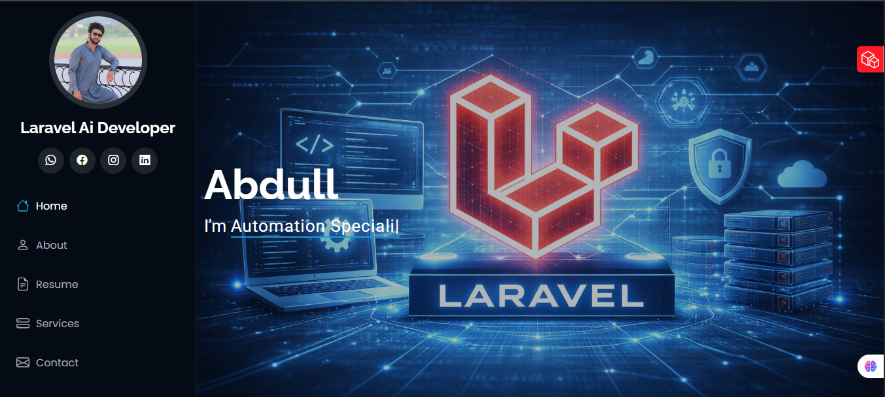
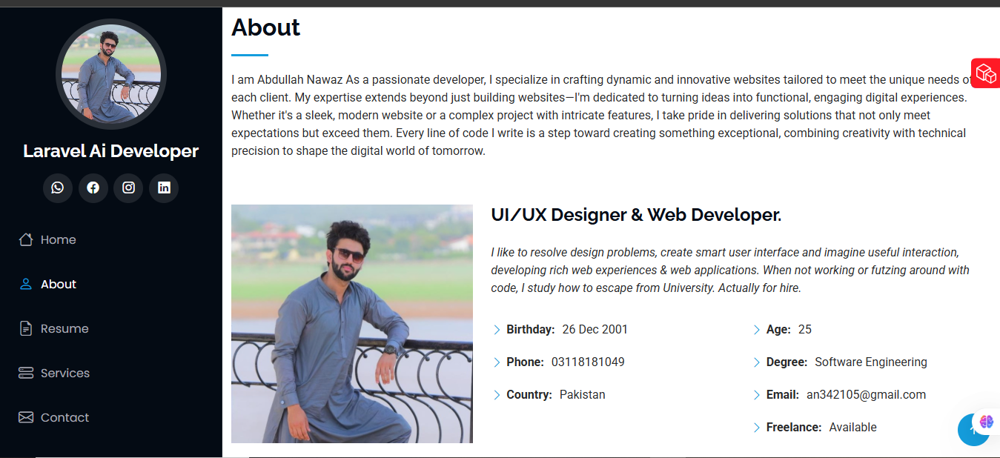
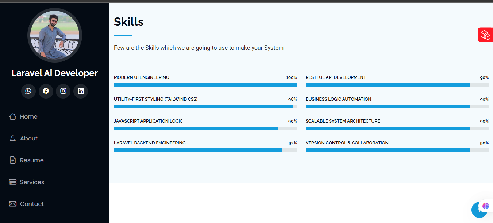
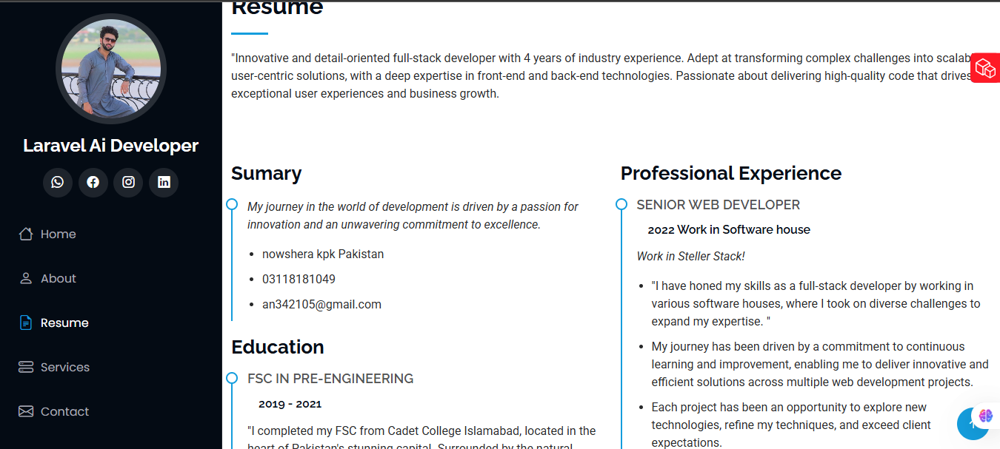
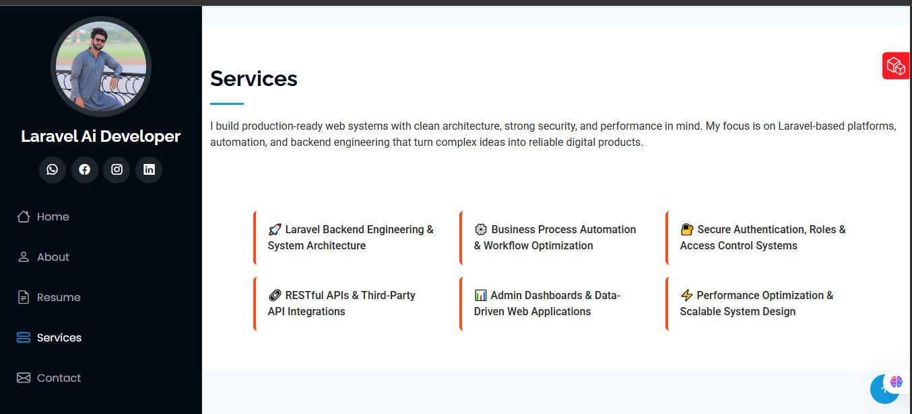
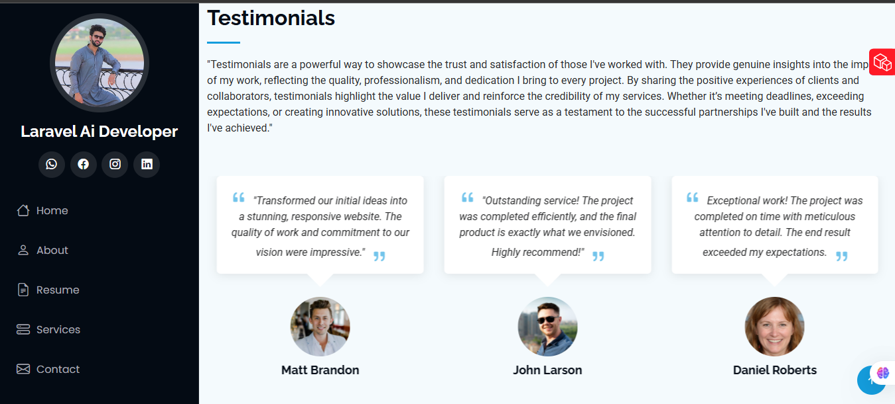
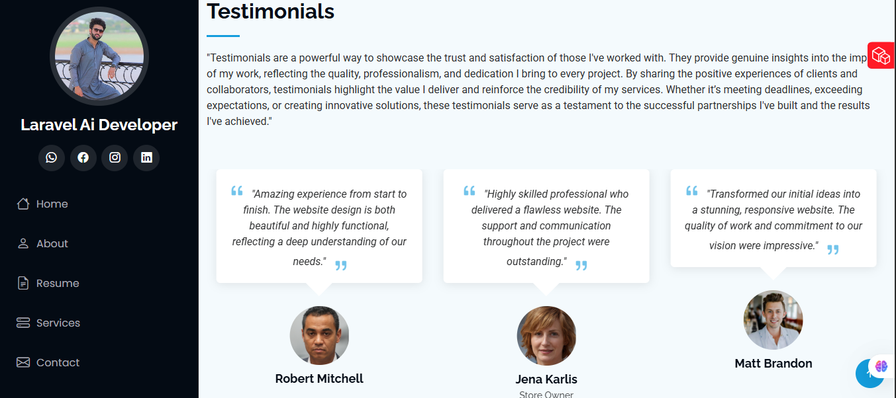

# 👋 Hi there, I’m **Abdullah Nawaz**  
### A Passionate **Laravel Ai & Full-Stack Web Developer**

Welcome to my portfolio repository!  
I'm a creative problem-solver who builds **dynamic digital experiences** — from sleek interfaces to robust web applications.

---

## 💻 About Me

I’m a dedicated developer with a strong passion for crafting modern, user-centric web solutions. 
I combine **creative design thinking** with **technical excellence** to build websites and applications that are beautiful,
functional, and impactful. Every project I take on reflects my commitment to quality, innovation, and continuous growth.
:contentReference[oaicite:1]{index=1}

- 🎯 **Role:** Laravel AI & Web Developer  
- 📍 **Location:** Pakistan  
- 🎓 **Degree:** Software Engineering  
- 📧 **Email:** an342105@gmail.com  
- 📞 **Phone:** +92 311 8181049  
- 🚀 **Freelance:** Available for exciting opportunities & collaborations :contentReference[oaicite:2]{index=2}

---

## 🔥 Skills & Expertise

Below are some of the technologies and areas I work with:

| Frontend                     | Backend & Tools            |
|-----------------------------|---------------------------|
| HTML & CSS                  | Laravel                   |
| Tailwind CSS                | RESTful APIs              |
| JavaScript (ES6+)           | Version Control (Git)     |
| Modern UI Engineering       | Scalable System Architecture |
| Utility-First Styling       | Business Logic Automation |
| UI/UX Design Principles     | Backend Architecture      |  
*(Detailed skill percentages available on the live portfolio)* :contentReference[oaicite:3]{index=3}

---

## 🚀 What I Do

I create **visually appealing and fully functional digital products** — from responsive websites to complex web systems. Whether you are a startup or an established business, I help bring your ideas to life with clean code and modern design.

**Services I provide:**
- ⚙️ Automation and Ai Integration
- 🌐 Website & Web App Development  
- 🎨 UI/UX Design & Interface Solutions  
- ⚙️ Backend Engineering & Workflow Optimization  
- 💡 Scalable System Architecture  
- 🔗 Third-Party API Integration  
- 📈 Performance Optimization :contentReference[oaicite:4]{index=4}

---

## 💼 Professional Journey

Over the years, I’ve had the opportunity to work on real-world projects — solving design challenges, architecting systems,
and delivering results that make a difference. Each project helped shape my skills and reflect my drive toward excellence.
:contentReference[oaicite:5]{index=5}

---

## 📂 Portfolio Highlights

## 📂 About me

## 📂 Skills

## 📂 Resume

## 📂 porfolio

## 📂 Services

---

## 🌟 Testimonials

## 📬 Let’s Connect

I’m always open to new challenges, collaborations, and opportunities.

📨 **Email:** an342105@gmail.com  
📞 **Phone:** +92 311 8181049  
🌐 **Portfolio:** https://abdullprofile.vercel.app :contentReference[oaicite:6]{index=6}

---

## 🧠 Fun Fact

_"Every line of code I write is a step toward creating something exceptional — where creativity meets logic."_ :contentReference[oaicite:7]{index=7}

---

> *Thank you for visiting my profile! Let’s build something amazing together 🚀*
